# Pronto para a aventura?

# 🛡️ RPrincessG - Discord RPG Engine

O **RPrincessG** é um motor de RPG para Discord de alto desempenho, desenvolvido para automatizar mecânicas complexas e a gestão de dados de campanhas. O projeto combina uma infraestrutura robusta de backend com sistemas de jogo profundos, permitindo uma experiência de interpretação de papéis fluida e totalmente integrada ao chat.

## 🎮 Sistema de RPG e Personagens

O núcleo do bot foi projetado para gerir o ciclo de vida completo de um herói, garantindo que cada ação tenha impacto real nos atributos:

* **Criação e Gestão de Personagens:** Sistema de registro de fichas com persistência de dados para atributos como Força, Agilidade, Vitalidade e Mana.
* **Sistema de Classes:** Implementação de classes distintas com modificadores de status únicos, permitindo diferentes estilos de gameplay e progressão.
* **Gerenciamento de Skills:** Sistema de aprendizado e evolução de habilidades. O bot valida automaticamente o custo de recursos (MP/Energia) e o nível necessário através da base de dados.
* **Bots e NPCs:** Motor de criação de entidades não-jogáveis (inimigos e aliados) e atributos escalonáveis.

## ⚔️ Mecânicas de Combate Avançadas

O diferencial técnico do **RPrincessG** está no seu motor de batalha automatizado e dinâmico:

* **Batalhas Baseadas em Agilidade:** Sistema de iniciativa inteligente que calcula a ordem de atuação com base no atributo de Agilidade, permitindo que personagens mais rápidos ajam primeiro ou com mais frequência.
* **Sistema de Turnos Dinâmico:** Gerenciador de estado de combate que controla a fila de ações, aplica efeitos de status e processa o fluxo da luta em tempo real.
* **Cálculos de Dano e Defesa:** Fórmulas matemáticas integradas que processam bônus de classe, eficácia de skills e mitigação de dano por equipamentos.

## 🛠️ Stack Tecnológica

* **Runtime:** [Node.js](https://nodejs.org/)
* **Base de Dados:** [SQLite3](https://www.sqlite.org/) (Modelagem relacional para garantir consistência entre fichas, inventários e logs de combate).
* **Arquitetura:** Design modular focado em separação de responsabilidades (Lógica de jogo vs. Motor de mensagens).

## 🏗️ Desafios Técnicos Superados

Um dos maiores desafios foi a implementação do **sistema de turnos assíncrono**. Garantir que múltiplos combates pudessem ocorrer simultaneamente em diferentes canais, sem conflitos na base de dados, exigiu uma gestão rigorosa de concorrência no SQLite3. 

A lógica de combate foi otimizada para processar cálculos de atributos em milissegundos, garantindo que o tempo de resposta do bot (latência) seja imperceptível para os jogadores, mesmo em situações de alta carga de dados.

## ⌨️ Exemplos de Funções e Comandos

O bot oferece uma interface intuitiva para os jogadores:
* `//ficha` / `//status` - Visualização detalhada da ficha e atributos.
* `//sinventario` - Listagem e gerenciamento de habilidades aprendidas e anotações do usuário.
* `//inventario` - Listagem e gerenciamento de inventário  de itens / materiais.
* ``//[Nome da Skill]` - Execução de ações dentro do sistema de turnos, cada skill tendo comandos padrões únicos mas com opção de personalização.
* `//dist [local]` - Gestão de pontos de atributo ganhos por level pelo player sem intervenção do mestre.

## 📈 Status do Projeto

Atualmente, o motor principal e o sistema de persistência estão 100% operacionais. O desenvolvimento está focado na expansão da árvore de habilidades e no refinamento da interface visual através de Discord Embeds.

## 📸 Demonstração Visual

Abaixo, você pode conferir as principais interfaces e funcionalidades do **RPG90SYS** em operação no Discord.

### 👤 Gestão de Personagem
| Funcionalidade | Descrição | Imagem |
|---|---|---|
| **Criação de Ficha** | Interface intuitiva via Modal do Discord para preenchimento de dados. | 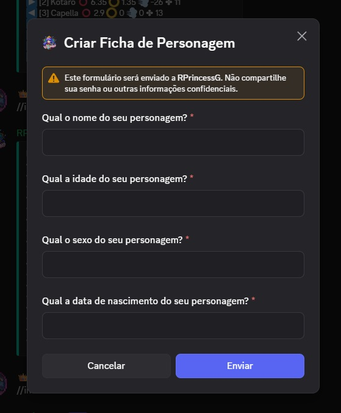 |
| **Ficha Principal** | Exibição consolidada de atributos, classe e informações do herói. |  |
| **Atributos Detalhados** | Visualização técnica e limpa dos status do personagem. | 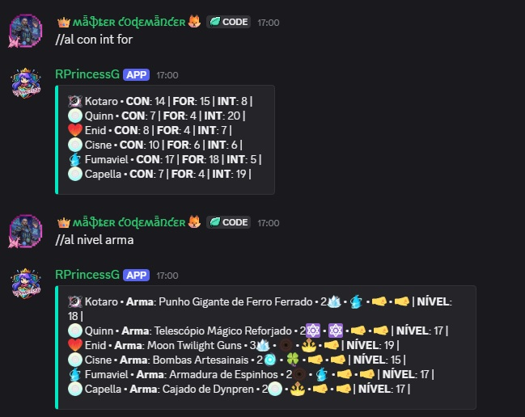 |
| **Perícias** | Painel de exibição das competências e perícias aprendidas. | 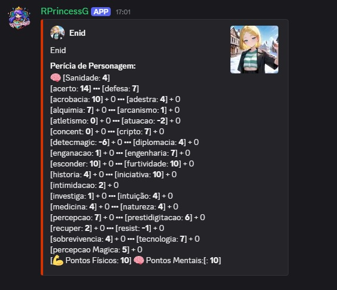 |
| **Equipamentos** | Interface de visualização de itens equipados e bônus ativos. | 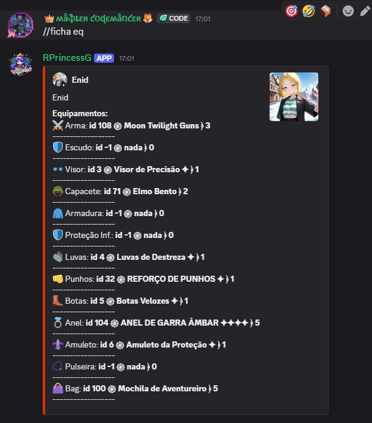 |

### ⚔️ Sistema de Batalha e Skills
| Funcionalidade | Descrição | Imagem |
|---|---|---|
| **Fila de Batalha** | Gerenciamento dinâmico da ordem de ataque baseada em agilidade. | 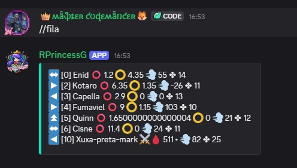 |
| **Turnos Automáticos** | Sistema que processa a transição de rodadas de forma autônoma. | 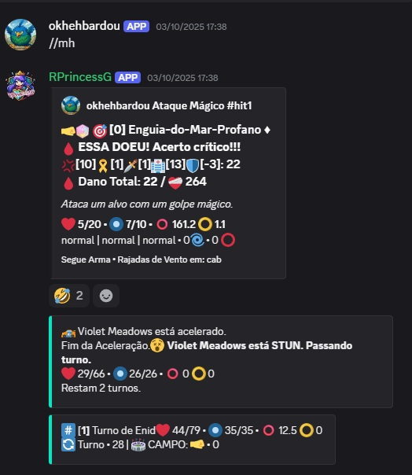 |
| **Exibição de Skill** | Detalhes visuais de uma habilidade específica em uso. | 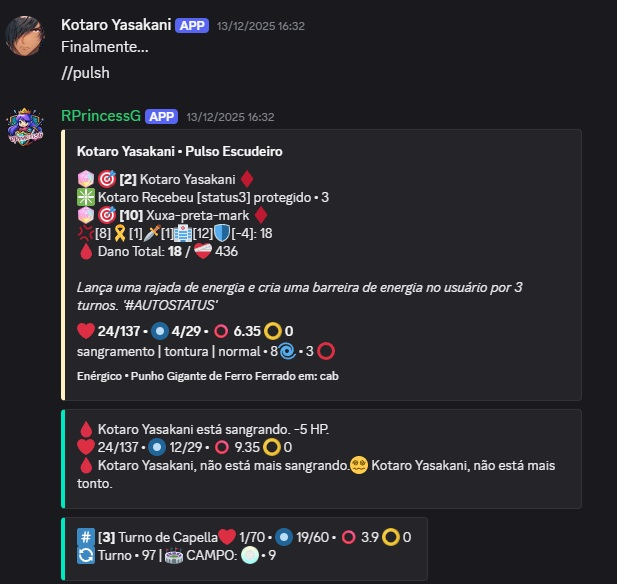 |
| **Multi-alvo** | Execução de habilidades que afetam múltiplos oponentes simultaneamente. | 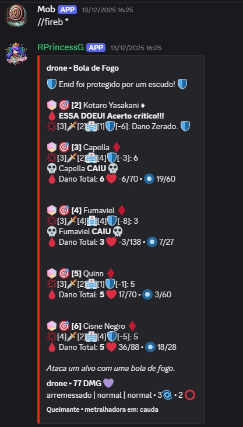 |
| **Suporte e Status** | Skills com funções variadas e aplicação de status automatizados. Exemplos: stun, envenenado, fortificado, enfraquecido, acelerado, arremessado, double (dobra dano) e vários outros | 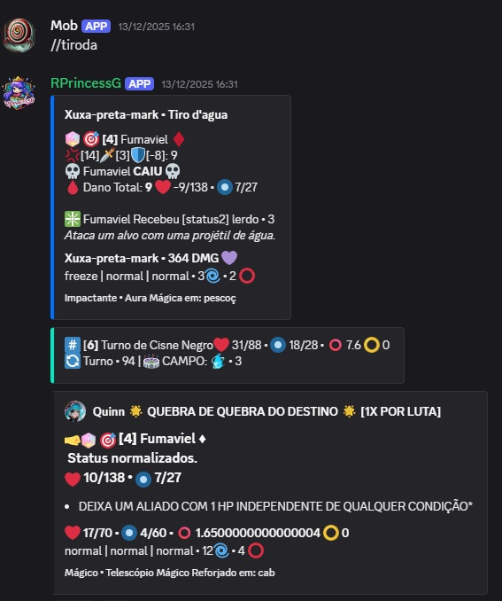 |
| **Cura** | Demonstração do sistema de recuperação de vitalidade. | 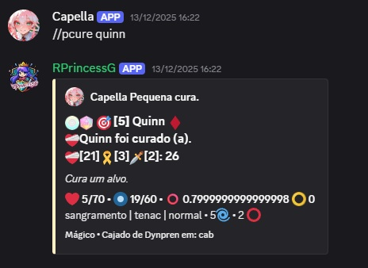 |

### 📦 Inventário e Economia
| Funcionalidade | Descrição | Imagem |
|---|---|---|
| **Gestão de Itens** | Sistema de inventário persistente para armazenamento e uso de itens. | 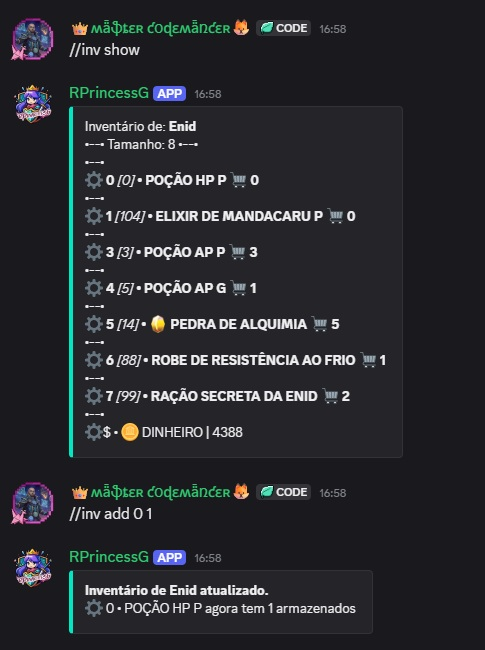 |
| **Loot Automático** | Sistema de drop baseado em sorte após o término de confrontos. | 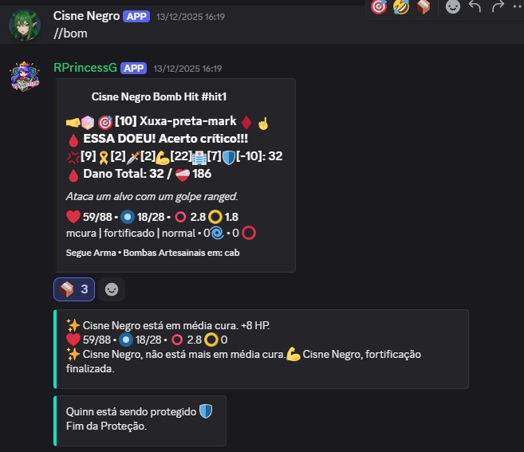 |

### ⚙️ Customização
| Funcionalidade | Descrição | Imagem |
|---|---|---|
| **Personalização de Comandos** | O bot permite a criação de **Aliases** para que o jogador personalize os comandos de suas skills favoritas, otimizando a jogabilidade. |  |
| **Personalização de Foto de Perfil de Personagem** | Cada personagem tem foto de perfil personalizável. | 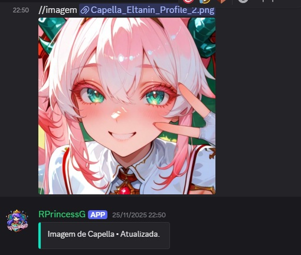 |
---

---
**Desenvolvido por:** [littbk](https://github.com/littbk)